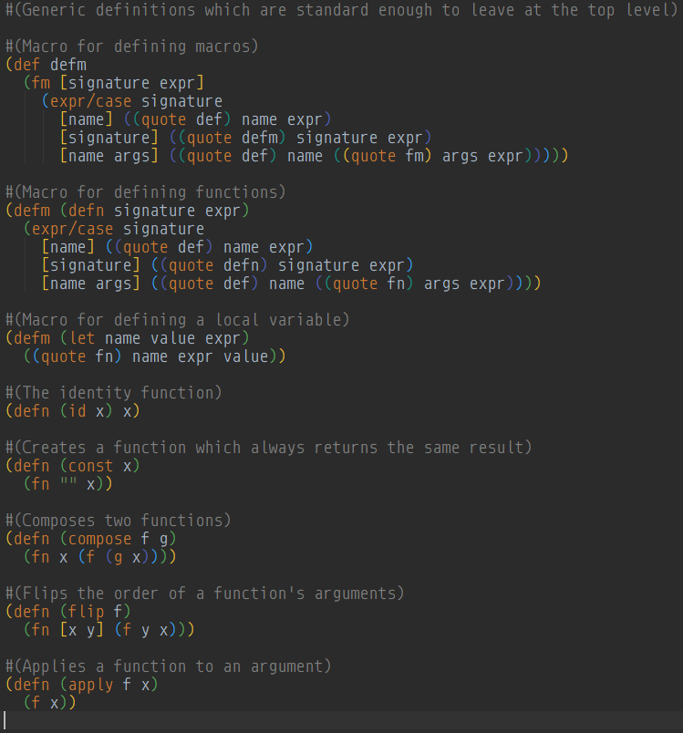

# IntelliJ-M



An IntelliJ plugin for the M programming language.

## To Use

```bash
git clone https://github.com/m-language/intellij-m
cd intellij-m
gradle buildPlugin
```

Then, in IntelliJ, go to `File -> Settings -> Plugins -> Install Plugin From Disk`
and select `intellij-m.jar` (located by default in `intellij-m/build/libs/`).

Installing [Rainbow Brackets](https://github.com/izhangzhihao/intellij-rainbow-brackets)
is also recommended.
